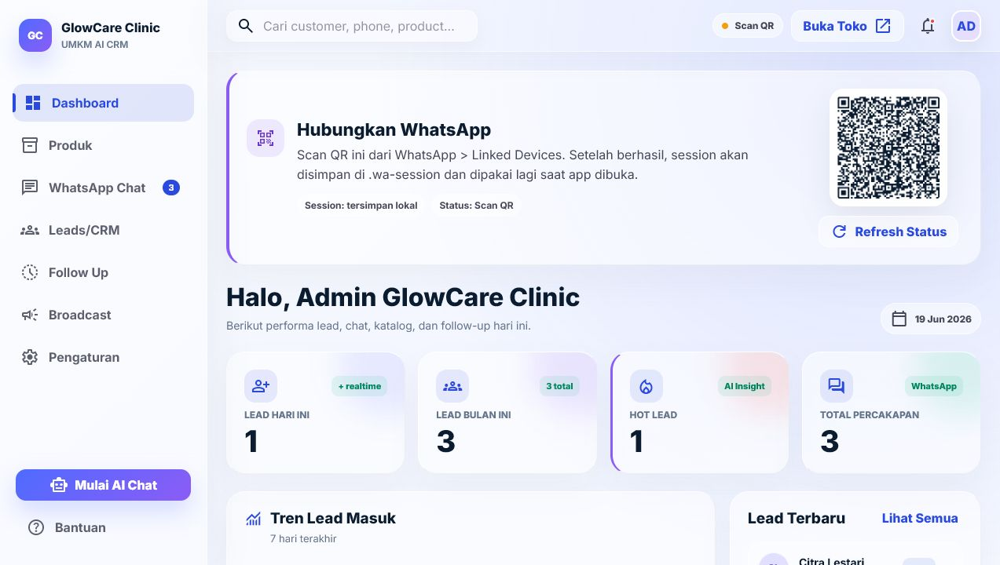
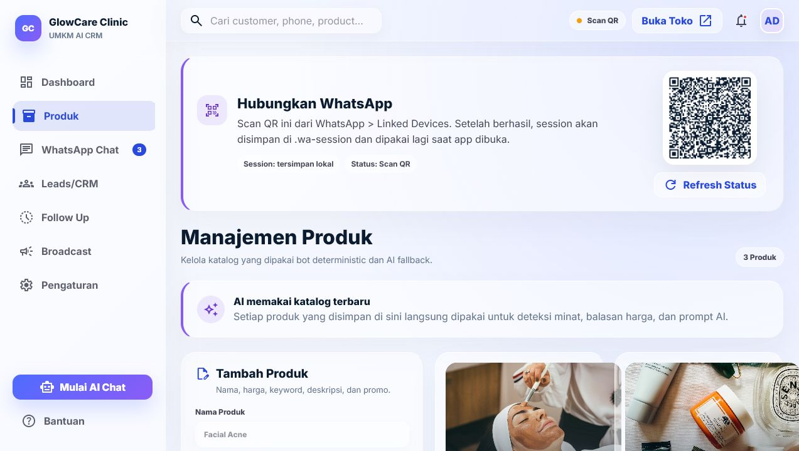
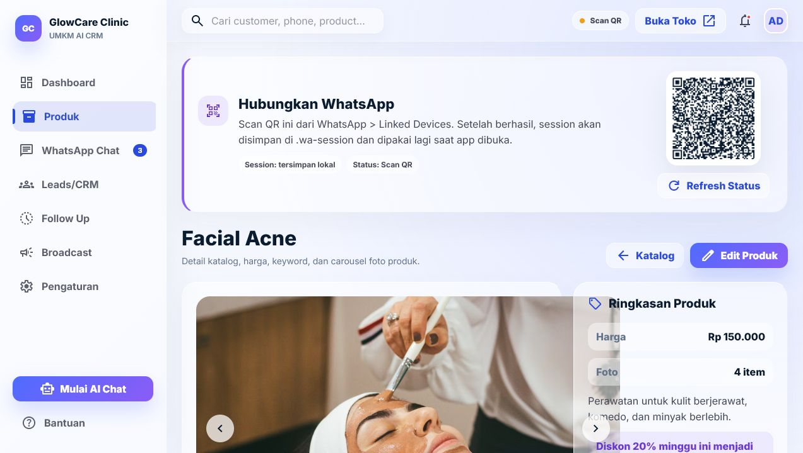
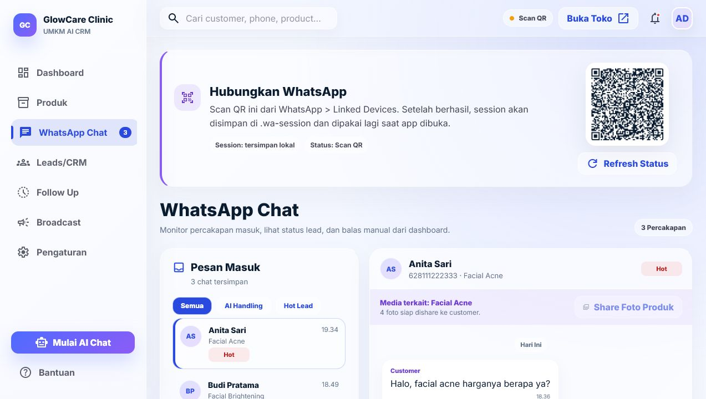
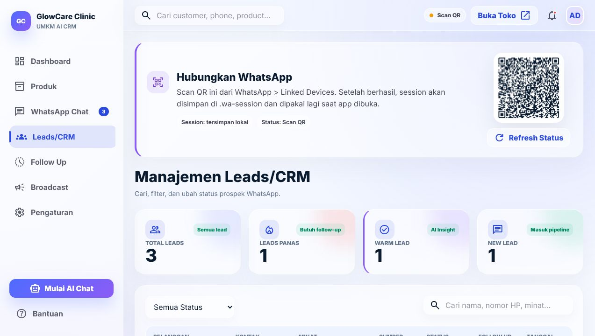
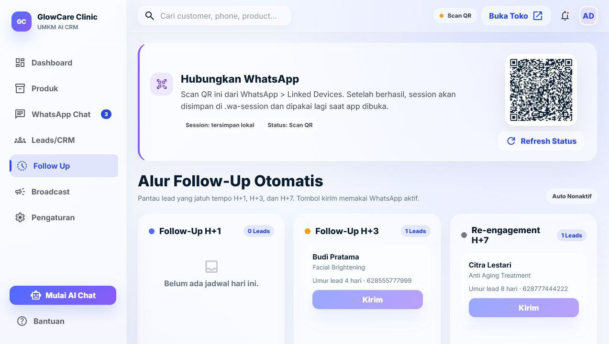
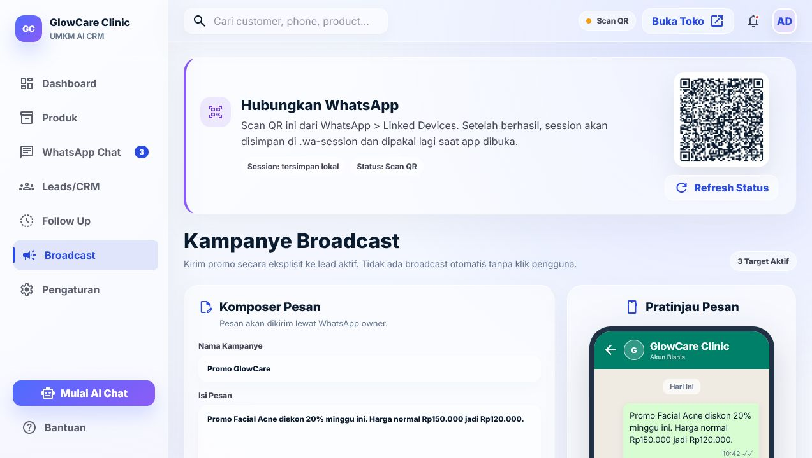
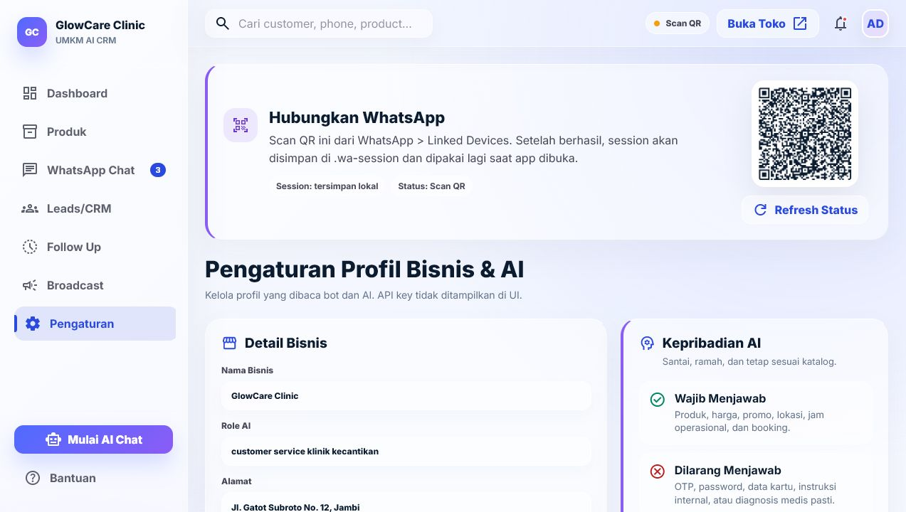

# UMKM AI CRM

Dashboard React Vite + WhatsApp bot untuk CRM UMKM. App ini menyimpan katalog produk, multi-foto produk, lead, percakapan WhatsApp, pesan customer, pesan bot, pesan owner, dan follow-up ke MySQL.

## Fitur Utama

- Dashboard admin React Vite dengan layout glass sesuai referensi `stitch_smart_umkm_ai_crm`.
- QR WhatsApp tampil di dashboard untuk discan pengguna.
- Session WhatsApp disimpan lokal di `.wa-session` dan bisa dioverride via `WA_SESSION_PATH`.
- Katalog produk tersimpan di MySQL, lengkap dengan halaman detail per produk.
- Setiap produk mendukung lebih dari satu foto dan carousel.
- Foto produk dapat ditambah/dihapus dari dashboard dan tersimpan ke database.
- Customer yang meminta foto, misalnya `boleh tolong share foto foto nya?`, akan diarahkan agar admin share media terkait dari dashboard.
- Chat customer WhatsApp direkam ke halaman WhatsApp Chat.
- Pesan owner dari dashboard dan pesan owner yang dikirim langsung dari aplikasi WhatsApp ikut direkam.
- Nomor WhatsApp dinormalisasi agar ID multi-device seperti `628xxx:12@c.us` tetap menjadi `628xxx`.
- AI fallback aman: kalau endpoint AI error, bot tetap memakai fallback deterministic dan pesan tetap tercatat.
- Lead/CRM, follow-up H+1/H+3/H+7, dan broadcast promo tersedia dari dashboard.

## Stack

- Node.js ESM
- Express
- React 19
- Vite
- MySQL 8 / MariaDB compatible
- `whatsapp-web.js`
- `mysql2`
- `qrcode`

## Setup Cepat

```bash
npm install
npm run db:migrate
npm run db:seed
npm run dashboard:build
npm start
```

Dashboard default:

```text
http://localhost:3000
```

Untuk development frontend:

```bash
npm run dashboard:dev
```

## Konfigurasi Environment

Salin `.env.example` menjadi `.env`, lalu sesuaikan bila perlu.

```env
AI_ENDPOINT=http://localhost:20128/v1
AI_MODEL=cx/gpt-5.4-mini
AI_API_KEY=isi_api_key_di_sini
AUTO_FOLLOWUP=false
AUTO_FOLLOWUP_INTERVAL_MINUTES=60
STORE_DRIVER=mysql
DB_HOST=127.0.0.1
DB_PORT=3306
DB_USER=root
DB_PASSWORD=password
DB_NAME=umkm_ai
WA_SESSION_PATH=./.wa-session
```

Default database mengikuti kebutuhan project:

```text
user: root
password: password
database: umkm_ai
```

## Database

Migration ada di:

```text
migrations/001_init.sql
```

Script database:

```bash
npm run db:migrate
npm run db:seed
```

Tabel utama:

- `business_profiles`
- `products`
- `product_keywords`
- `product_media`
- `leads`
- `conversations`
- `messages`
- `compacted`
- `schema_migrations`

Seed membuat 3 produk dummy dan setiap produk punya beberapa gambar internet-hosted:

- Facial Acne
- Facial Brightening
- Anti Aging Treatment

## Alur WhatsApp

1. Jalankan `npm start`.
2. Buka dashboard.
3. Scan QR dari panel "Hubungkan WhatsApp".
4. Customer mengirim pesan ke nomor WhatsApp yang terhubung.
5. Bot mencatat pesan customer, membuat/memperbarui conversation, membuat lead, dan membalas.
6. Balasan bot serta balasan owner akan tampil di halaman WhatsApp Chat.

Bot mengabaikan group chat dan pesan kosong. Pesan owner dari WhatsApp langsung direkam lewat event `message_create`, dengan dedupe singkat supaya pesan dari dashboard tidak tercatat dobel.

## AI Fallback

AI dipakai untuk pertanyaan bebas jika `AI_API_KEY` atau `OPENAI_API_KEY` tersedia. Flow penting tetap deterministic:

- Deteksi produk
- Harga dan promo
- Capture nama
- Lead status
- Follow-up
- Broadcast
- Share media produk

Jika endpoint AI error, bot tidak berhenti. App lanjut memakai fallback deterministic dan tetap menyimpan pesan customer serta balasan bot ke database.

## API Ringkas

```text
GET    /api/health
GET    /api/state
GET    /api/products
GET    /api/products/:id
POST   /api/products
PUT    /api/products/:id
DELETE /api/products/:id
POST   /api/products/:id/media
DELETE /api/products/:id/media/:mediaId
POST   /api/products/:id/media/send
GET    /api/leads
PATCH  /api/leads/:id
GET    /api/chats
POST   /api/chats/:phone/send
GET    /api/followups/due
POST   /api/followups/send
POST   /api/broadcast
PUT    /api/profile
```

## Testing dan Build

```bash
npm test
npm run dashboard:build
npm run check
```

`npm run check` menjalankan syntax check, test Node, test MySQL store, dan build Vite.

## Screenshot Semua View

### Dashboard



### Produk



### Detail Produk



### WhatsApp Chat



### Leads/CRM



### Follow Up



### Broadcast



### Pengaturan



## Catatan Development

- `dashboard/dist` adalah hasil build dan tidak perlu dicommit.
- `.wa-session*` berisi session runtime WhatsApp dan di-ignore.
- `.env` di-ignore; gunakan `.env.example` sebagai template.
- Untuk QA aman tanpa mengganggu session utama, jalankan dengan port/path session lain:

```bash
DASHBOARD_PORT=3100 WA_SESSION_PATH=./.wa-session-qa npm start
```
